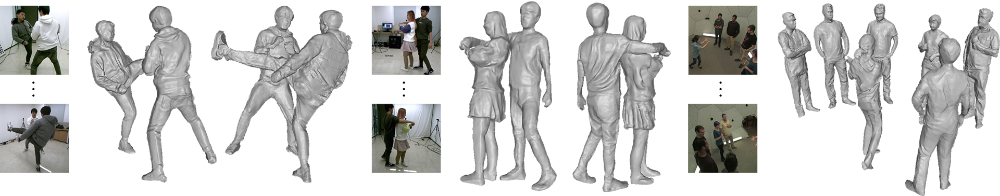

# [DeepMultiCap: Performance Capture of Multiple Characters Using Sparse Multiview Cameras (ICCV 2021)](http://www.liuyebin.com/dmc/dmc.html)
[Yang Zheng*](https://y-zheng18.github.io/zy.github.io/), Ruizhi Shao*, [Yuxiang Zhang](https://zhangyux15.github.io/), [Tao Yu](http://ytrock.com/), [Zerong Zheng](http://zhengzerong.github.io/), [Qionghai Dai](http://media.au.tsinghua.edu.cn/english/team/qhdai.html), [Yebin Liu](http://www.liuyebin.com/).

[](https://arxiv.org/abs/2105.00261)

This repository contains the official pytorch implementation of ”*DeepMultiCap: Performance Capture of Multiple Characters Using Sparse Multiview Cameras*“.



### News
* **[2021/9/26]** We added more scans to [MultiHuman dataset](https://github.com/y-zheng18/MultiHuman-Dataset). You can use MultiHuman to train/fine-tune our model or your own models!
* **[2021/9/18]** [MultiHuman dataset](https://github.com/y-zheng18/MultiHuman-Dataset) for evaluation purpose is available!

## Requirements
- [PyTorch](https://pytorch.org/)
- torchvision
- trimesh
- numpy
- matplotlib
- PIL
- skimage
- tqdm
- cv2
- json
- taichi
- taichi_three
- taichi_glsl

## Pretrained Model
We have provided pretrained model in [One Drive](https://mailstsinghuaeducn-my.sharepoint.com/:u:/g/personal/shaorz20_mails_tsinghua_edu_cn/EdVJtlpRplRHvGzQENV8ESQB4E_0ZY3B9l76XHuEowj1YA?e=MZqUxM)


## Training
To train DeepMultiCap model, please run the following code.
```
sh render_dataset.sh
sh trian.sh
```

## Demo
Run the following code to inference on the MultiHuman dataset.
```
sh render_two.sh
sh demo.sh
```

## Citation
```
@inproceedings{zheng2021deepmulticap,
title={DeepMultiCap: Performance Capture of Multiple Characters Using Sparse Multiview Cameras},
author={Zheng, Yang and Shao, Ruizhi and Zhang, Yuxiang and Yu, Tao and Zheng, Zerong and Dai, Qionghai and Liu, Yebin},
booktitle={IEEE Conference on Computer Vision (ICCV 2021)},
year={2021},
}
```
